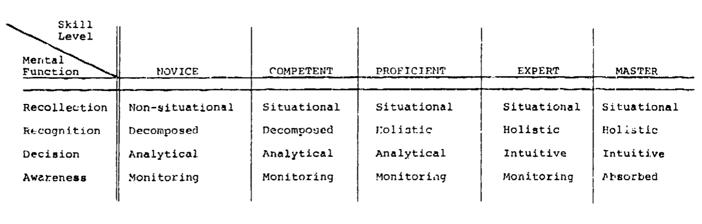
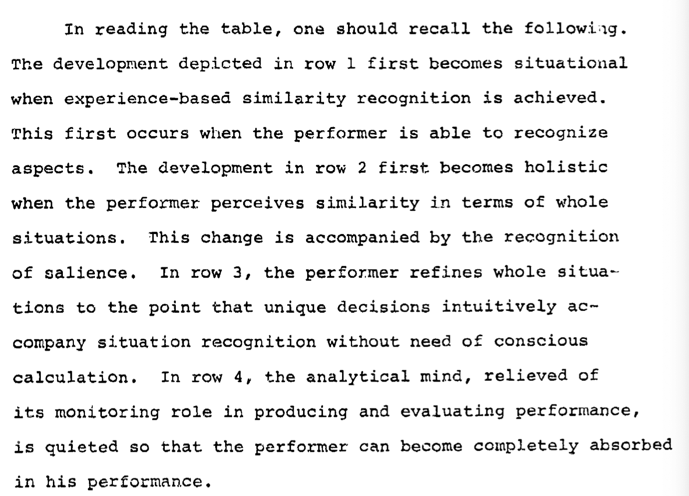

# Stage 1 : novice
- learn context-free features meaning isolate learning parts
- isolated knowledge will add up and will create compound effect
- eg. learning second language starting with learning phonetic rules without
  knowning the meaning of words or chess player knowing the value of each piece
on board or novice pilot knowing how to read cockpit instruments.

# Stage 2 : competence
- this stage achieved by adding concerete experience to first stage
- experience basically facing with real world situations
- this real world situations becomes some sort of pattern and will be recognized
  by learner later on
- eg. aftering learning phonetic of language student now know exactly what those
  sounds means when used in the right situations or chess player seeing some
patterns while playing them like "unbalanced pawn structure", "over-extended"

# Stage 3 : proficiency
- adding more practice puts learner into variety of situations hence adding more
  patterns
- this is basically extending your vocabulary of patterns as you recognize new
  patterns use novice knowledge to memorize them and recall it.
- eg. language learned know using words in sentence at rigth time and enable him
  to describe situations, ask or order something, chess player know try to use
these patterns to his advantage or see them as irrelevant.
- given principle rule with knowledge of set of patterns and incoming cues will
  help learned to decide what to do in that situation.

# Stage 4 : expertise
- this is basically having vast amount of repertoire for situations.
- any similar situtation will trigger automatic action.
- eg. langugae learner discover he is using langugage rules unconsciously, chess
  player anytime sees any situtation or pattern will make appropriate move
instantly without realizing.

# Stage 5 : mastery
- this is not another level but a state of 'expertise'
- normally expert pay attention to his performance all the time
- mastery stage is basically where your performance tops your previous ones and
  you no longer have an attention span for your performance.

